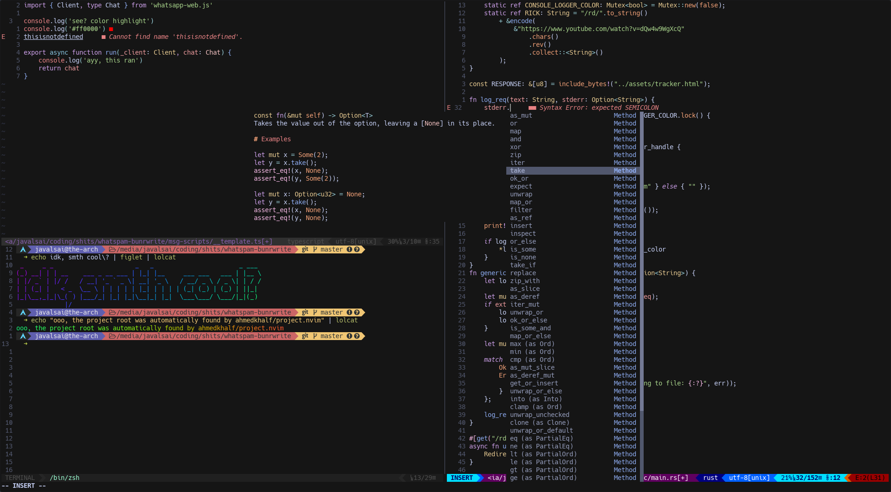

# Preview

# Installation
* Install Neovim
* Install VimPlug for Neovim
* Copy this config into `.config/nvim`, open vim and run `:PlugInstall`
* Install LSPs specified in `.config/nvim/lua/lsps.lua`
