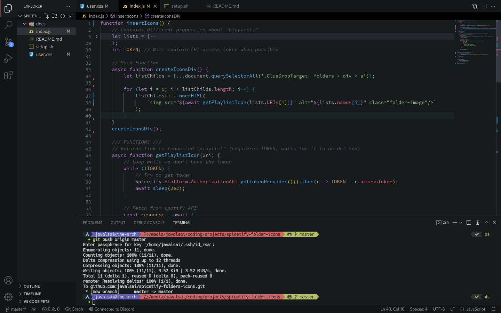

# Preview

# Installation
* Install VSCodium if you don't have it (it should work in vscode too).
* Press Ctrl + Shift + P and type "Preferences: Open Settings (JSON)".
* Paste `settings.json` in there or merge them as you want.
* There are also configurations for this extensions in it:
  * usernamehw.indent-one-space
  * tonybaloney.vscode-pets
  * naumovs.color-highlight
