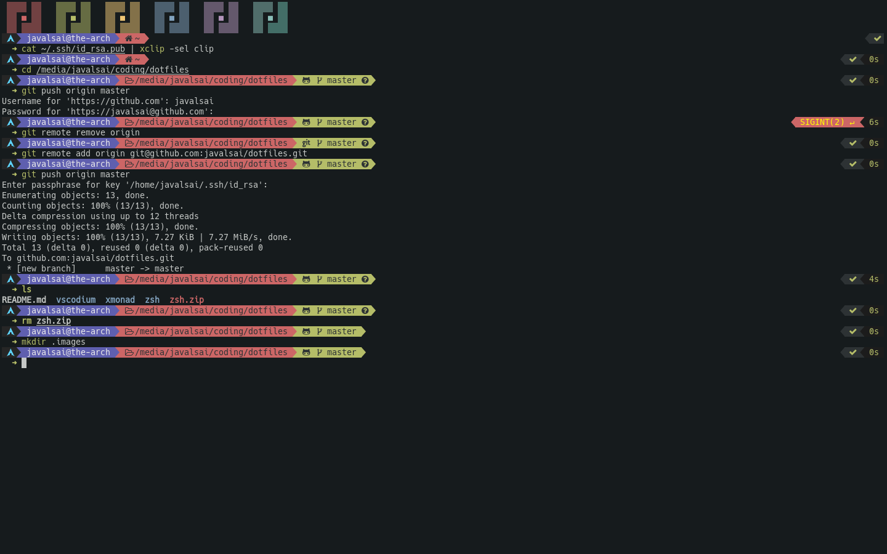

# Preview

The image appearance also depends on my alacritty config that I'll upload soon

# Installation
* Install [zsh](https://github.com/ohmyzsh/ohmyzsh/wiki/Installing-ZSH), [oh-my-zsh](https://ohmyz.sh/) and [powerlevel9k](https://github.com/Powerlevel9k/powerlevel9k).
* Copy `.zshrc` file to `~`.
* Also install [zsh-command-time](https://github.com/popstas/zsh-command-time) to display command execution time in the right side, if you don't install it you'll have to remove parts related to it in the `.zshrc` file.

# PD
I have a file called `.pathrc` that is sourced in `.zshrc`, I use it for environmental variables.
I also have some stupid aliases around ln 83 and the file runs [colorscript](https://gitlab.com/dwt1/shell-color-scripts), so make sure that you have it installed.
